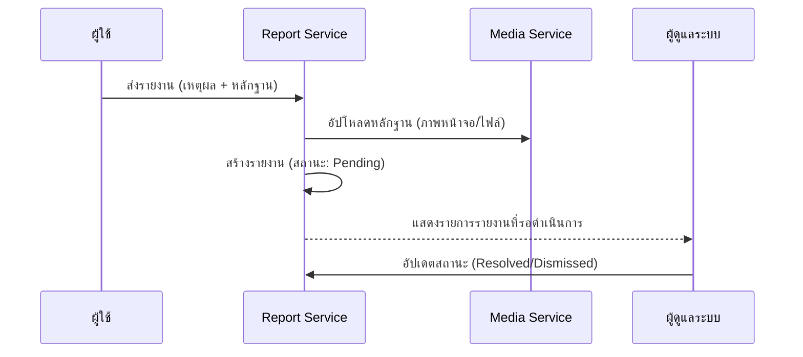

# คู่มือสำหรับนักพัฒนา: โมดูลการรายงาน (Report Module)

โมดูลการรายงานช่วยสนับสนุนกระบวนการตรวจสอบโดยชุมชน โดยอนุญาตให้ผู้ใช้สามารถแจ้งเบาะแสเนื้อหาที่ไม่เหมาะสมหรือการฉ้อโกงที่อาจเกิดขึ้นได้

## 1. โครงสร้างโปรแกรม (Program Structure)

โมดูลการรายงานเป็นระบบติดตามเคส (Case-tracking) พร้อมกระบวนการทำงานสำหรับการตรวจสอบโดยผู้ดูแลระบบ

### โครงสร้างฝั่ง Backend (`okard-backend/src/modules/report`)
- [controller.py](file:///Users/wisapat/Documents/Code/Git/okard-backend/src/modules/report/controller.py): API สำหรับการส่งรายงานและการเรียกดูรายการสำหรับผู้ดูแลระบบ
- [service.py](file:///Users/wisapat/Documents/Code/Git/okard-backend/src/modules/report/service.py): ตรรกะสำหรับการบันทึกการรายงานและแนบไฟล์หลักฐาน
- [repo.py](file:///Users/wisapat/Documents/Code/Git/okard-backend/src/modules/report/repo.py): การดำเนินการฐานข้อมูลสำหรับตาราง `report`
- [model.py](file:///Users/wisapat/Documents/Code/Git/okard-backend/src/modules/report/model.py): โมเดล SQLAlchemy ที่กำหนด `reporter_id`, `reported_item_id`, `reason` และ `status`
- [schema.py](file:///Users/wisapat/Documents/Code/Git/okard-backend/src/modules/report/schema.py): โครงสร้างข้อมูลสำหรับการตรวจสอบความถูกต้อง

---

## 2. ภาพรวมการทำงาน (Top-Down Functional Overview)

กระบวนการทำงานของการรายงานจะเริ่มจากการส่งข้อมูลโดยผู้ใช้ไปจนถึงการตัดสินโดยผู้ดูแลระบบ

---

## 3. คำอธิบายโปรแกรมย่อย (Subprogram Descriptions)

### Backend: ชั้นบริการ (Service Layer - [service.py](file:///Users/wisapat/Documents/Code/Git/okard-backend/src/modules/report/service.py))

| โปรแกรมย่อย | หน้าที่ความรับผิดชอบ | ข้อมูลเข้า (Input) | ข้อมูลออก (Output) |
| :--- | :--- | :--- | :--- |
| `create_report` | บันทึกข้อความรายงานและประมวลผลไฟล์หลักฐานอย่างน้อยหนึ่งไฟล์ | `db`, `reporter_id`, `data`, `files` | `Report` |
| `update_report_status`| อนุญาตให้ผู้ดูแลระบบเปลี่ยนสถานะของการรายงาน | `db`, `report_id`, `status` | `Report` |

---

## 4. การสื่อสารและพารามิเตอร์ (Communication & Parameters)

1.  **การรายงานแบบ Polymorphic**: แม้ว่าปัจจุบันจะใช้สำหรับแคมเปญ แต่โครงสร้างฐานข้อมูลอนุญาตให้ `reported_item_id` อ้างถึงเอนทิตีอื่นๆ ได้ผ่านพารามิเตอร์ `target_type` หากมีการขยายระบบในอนาคต
2.  **การจัดการหลักฐาน**: การรายงานใช้ตรรกะของ `media_service` เพื่อจัดเก็บไฟล์ในโฟลเดอร์ `report/` เฉพาะใน MinIO
3.  **วงจรสถานะ**: รายงานจะเริ่มด้วยสถานะ `pending` และสามารถเปลี่ยนเป็น `investigating`, `resolved` หรือ `spam`
4.  **นโยบายการปกปิดตัวตน**: แม้จะมีการเก็บ `reporter_id` ไว้สำหรับบันทึกภายใน แต่ข้อมูลนี้มักจะถูกปิดบังไว้ในหน้าประมวลผลของผู้ดูแลระบบเพื่อปกป้องผู้แจ้งเบาะแส
