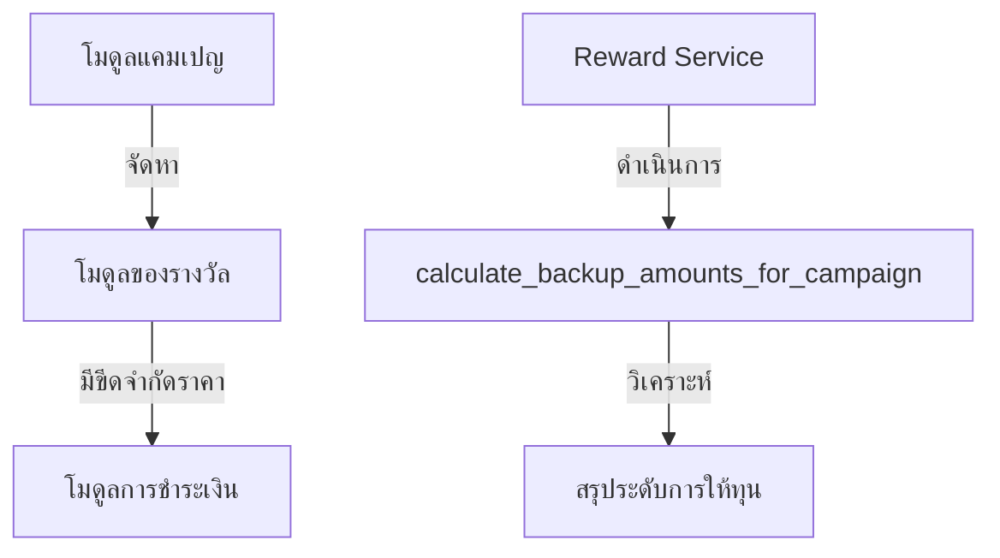

# คู่มือสำหรับนักพัฒนา: โมดูลของรางวัล (Reward Module)

โมดูลของรางวัลทำหน้าที่ควบคุมระบบสิ่งจูงใจสำหรับผู้สนับสนุน ช่วยให้ผู้สร้างสามารถเสนอสิทธิประโยชน์ (ทั้งทางกายภาพหรือดิจิทัล) ตามระดับการให้ทุนที่แตกต่างกัน

## 1. โครงสร้างโปรแกรม (Program Structure)

เช่นเดียวกับแคมเปญ เอนทิตีของรางวัลเป็นโหนดลูกของแคมเปญ (Campaign) และถูกรวมเข้ากับขั้นตอนการสร้างเนื้อหาอย่างแน่นหนา

### โครงสร้างฝั่ง Backend (`okard-backend/src/modules/reward`)
- [service.py](file:///Users/wisapat/Documents/Code/Git/okard-backend/src/modules/reward/service.py): จัดการตรรกะทางธุรกิจของของรางวัลและกระตุ้นการคำนวณระดับการให้ทุน
- [repo.py](file:///Users/wisapat/Documents/Code/Git/okard-backend/src/modules/reward/repo.py): จัดการการจัดเก็บข้อมูลถาวรและการรวมข้อมูลตามระดับราคาที่ซับซ้อน
- [model.py](file:///Users/wisapat/Documents/Code/Git/okard-backend/src/modules/reward/model.py): โมเดล SQLAlchemy ที่กำหนดแอตทริบิวต์ของรางวัล (ราคา, จำนวน, กำหนดส่งโดยประมาณ)
- [schema.py](file:///Users/wisapat/Documents/Code/Git/okard-backend/src/modules/reward/schema.py): โครงสร้างข้อมูลสำหรับการตรวจสอบความถูกต้องของ Pydantic

---

## 2. ภาพรวมการทำงาน (Top-Down Functional Overview)

ของรางวัลช่วยสร้างชั้นสิ่งจูงใจที่มีโครงสร้างสำหรับผู้สนับสนุน

---

## 3. คำอธิบายโปรแกรมย่อย (Subprogram Descriptions)

### Backend: ชั้นบริการ (Service Layer - [service.py](file:///Users/wisapat/Documents/Code/Git/okard-backend/src/modules/reward/service.py))

| โปรแกรมย่อย | หน้าที่ความรับผิดชอบ | ข้อมูลเข้า (Input) | ข้อมูลออก (Output) |
| :--- | :--- | :--- | :--- |
| `create_reward_with_media` | สร้างบันทึกของรางวัลและเชื่อมโยงกับรูปภาพ | `db`, `reward_data` (รายการ), `files` | `List[Reward]` |
| `update_reward_with_media` | อัปเดตรายละเอียดของรางวัลและสามารถเลือกเปลี่ยนรูปภาพได้ | `db`, `reward_id`, `data`, `files` | `Reward` |
| `calculate_backup_amounts` | คำนวณการกระจายระดับของรางวัลใหม่ตามรายการการชำระเงินใหม่ | `db`, `campaign_id` | ไม่มี (อัปเดตลงใน Repo) |

---

## 4. การสื่อสารและพารามิเตอร์ (Communication & Parameters)

1.  **ระดับการให้ทุน (Funding Tiers)**: พารามิเตอร์ `price` ในโครงสร้างข้อมูลของรางวัลจะเป็นตัวกำหนดจำนวนเงินขั้นต่ำที่ผู้สนับสนุนต้องจ่ายเพื่อรับรางวัลนั้นๆ
2.  **การวิเคราะห์ระดับรางวัล**: ฟังก์ชัน `calculate_backup_amounts_for_campaign` จะถูกกระตุ้นโดยอัตโนมัติหลังจากมีการชำระเงินหรืออัปเดตของรางวัล เพื่อปรับปรุงข้อมูลสถิติ "สรุปรายละเอียดผู้สนับสนุน" (Supporter Breakdown)
3.  **การจัดการสื่อ**: โดยปกติของรางวัลแต่ละรายการจะมีรูปภาพประกอบ ซึ่งจัดการผ่าน `MediaService`
4.  **การรวมระบบ**: โมเดล `Reward` จะเก็บ `campaign_id` ไว้เป็น Foreign key
