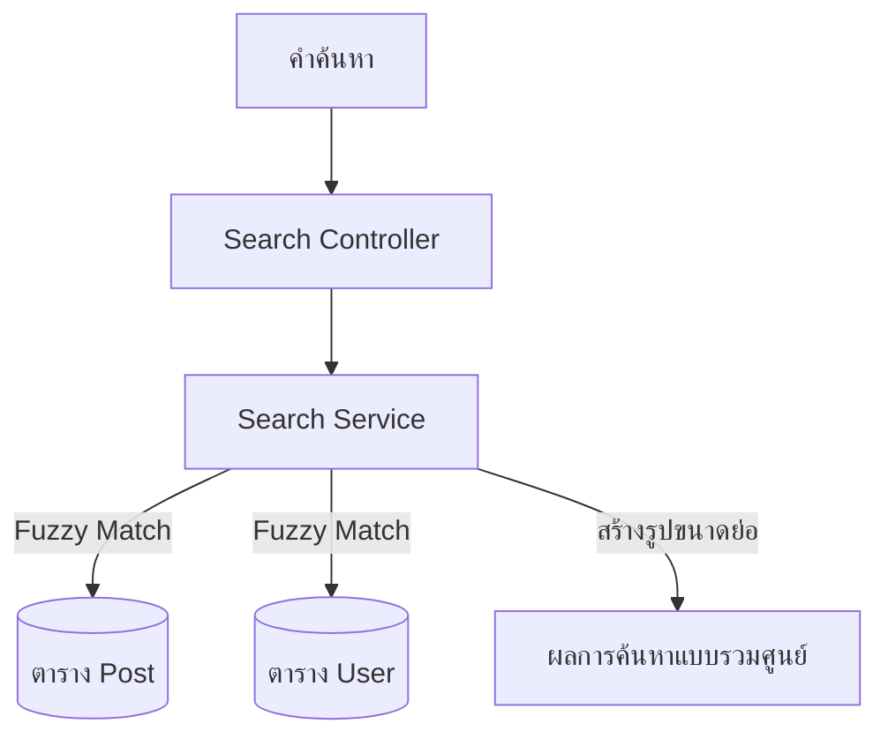

# คู่มือสำหรับนักพัฒนา: โมดูลการค้นหา (Search Module)

โมดูลการค้นหาจัดเตรียมระบบการค้นหาตามคำหลัก (Keyword-based discovery) สำหรับแคมเปญและผู้สร้างทั่วทั้งแพลตฟอร์ม

## 1. โครงสร้างโปรแกรม (Program Structure)

โมดูลการค้นหาเป็นบริการแบบอ่านอย่างเดียว (Read-only service) ที่ทำหน้าที่รวบรวมข้อมูลจากตารางเอนทิตีหลายๆ ตาราง

### โครงสร้างฝั่ง Backend (`okard-backend/src/modules/search`)
- [controller.py](file:///Users/wisapat/Documents/Code/Git/okard-backend/src/modules/search/controller.py): API สำหรับการดำเนินการค้นหาทั่วโลก
- [service.py](file:///Users/wisapat/Documents/Code/Git/okard-backend/src/modules/search/service.py): จัดลำดับการดึงข้อมูลจาก Repo และจัดรูปแบบผลลัพธ์ (เช่น การสร้าง URL สำหรับรูปภาพขนาดย่อ)
- [repo.py](file:///Users/wisapat/Documents/Code/Git/okard-backend/src/modules/search/repo.py): ประกอบด้วย SQL พื้นฐานหรือคำสั่งรัน ORM สำหรับการจับคู่คำแบบคลุมเครือ (Fuzzy matching) ในชื่อและคำอธิบาย
- [schemas.py](file:///Users/wisapat/Documents/Code/Git/okard-backend/src/modules/search/schemas.py): กำหนดโครงสร้าง `SearchResult` และ `SearchResponse` แบบรวมศูนย์

### โครงสร้างฝั่ง Frontend
- ถูกรวมไว้ในแถบค้นหาหลักของระบบและหน้ารายการผลลัพธ์การค้นหา

---

## 2. ภาพรวมการทำงาน (Top-Down Functional Overview)

โมดูลการค้นหาทำหน้าที่เป็น "ตัวกระจายคำสั่ง" ไปยังที่เก็บข้อมูล (Repositories) ของเอนทิตีต่างๆ

---

## 3. คำอธิบายโปรแกรมย่อย (Subprogram Descriptions)

### Backend: ชั้นบริการ (Service Layer - [service.py](file:///Users/wisapat/Documents/Code/Git/okard-backend/src/modules/search/service.py))

| โปรแกรมย่อย | หน้าที่ความรับผิดชอบ | ข้อมูลเข้า (Input) | ข้อมูลออก (Output) |
| :--- | :--- | :--- | :--- |
| `search` | จุดเริ่มต้นหลักที่รวบรวมผลลัพธ์จากผู้ใช้และโพสต์เข้าเป็นรายการเดียว | `db`, `query`, `request` | `SearchResponse` |
| `build_image_url` | จัดรูปแบบเส้นทางการจัดเก็บแบบสัมพัทธ์ให้เป็น URL ที่สมบูรณ์สำหรับฝั่ง Frontend | `request`, `path` | `str` (URL) |

---

## 4. การสื่อสารและพารามิเตอร์ (Communication & Parameters)

1.  **การค้นหาแบบคลุมเครือ (Fuzzy Searching)**: ชั้น Repository มักจะใช้การดำเนินการแบบไม่สนใจตัวพิมพ์เล็ก-ใหญ่ เช่น `LIKE` หรือ `ILIKE` ในฟิลด์ `post_header` และ `post_description`
2.  **ผลลัพธ์แบบหลายรูปแบบ (Polymorphic Results)**: ผลลัพธ์จะถูกส่งกลับพร้อมฟิลด์ `type` ("user" หรือ "post") เพื่อให้ฝั่ง Frontend สามารถแสดงไอคอนที่เหมาะสมและลิงก์ไปยังเส้นทางที่ถูกต้องได้
3.  **การเลือกรูปขนาดย่อ**: เมื่อโพสต์มีรูปภาพหลายรูป ชั้นบริการจะเลือกใช้รูปภาพมากกว่าสื่อประเภทอื่นๆ สำหรับใช้เป็นรูปขนาดย่อในผลการค้นหา
4.  **ประสิทธิภาพ**: สำหรับสภาพแวดล้อมที่มีข้อมูลจำนวนมหาศาล โมดูลนี้เป็นตัวเลือกอันดับต้นๆ สำหรับการทำดัชนีการค้นหาข้อความแบบเต็ม (Full-text search indexing เช่น GiST/GIN ใน Postgres) หรือการใช้เครื่องมือทำดัชนีภายนอก (Elasticsearch)
