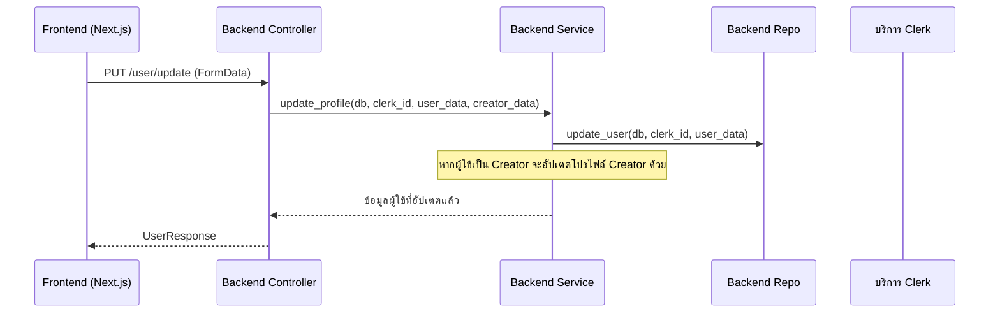

# คู่มือสำหรับนักพัฒนา: โมดูลผู้ใช้ (User Module)

โมดูลผู้ใช้มีหน้าที่รับผิดชอบในการจัดการข้อมูลตัวตนหลักของผู้ใช้ (เชื่อมโยงกับ Clerk), รายละเอียดโปรไฟล์ (ชื่อ, ประวัติย่อ, ที่อยู่) และการแสดงโปรไฟล์ต่อสาธารณะ

## 1. โครงสร้างโปรแกรม (Program Structure)

โมดูลผู้ใช้ถูกแบ่งออกเป็นส่วนประกอบฝั่ง Backend และ Frontend ที่ครบถ้วน

### โครงสร้างฝั่ง Backend (`okard-backend/src/modules/user`)
- [controller.py](file:///Users/wisapat/Documents/Code/Git/okard-backend/src/modules/user/controller.py): จุดเชื่อมต่อ API สำหรับ CRUD โปรไฟล์และการตรวจสอบการมีอยู่ของบัญชี
- [service.py](file:///Users/wisapat/Documents/Code/Git/okard-backend/src/modules/user/service.py): ตรรกะทางธุรกิจ รวมถึงการประสานงานกับโมดูลผู้สร้าง (`Creator`)
- [repo.py](file:///Users/wisapat/Documents/Code/Git/okard-backend/src/modules/user/repo.py): ตรรกะการเข้าถึงฐานข้อมูลสำหรับตาราง `User`
- [model.py](file:///Users/wisapat/Documents/Code/Git/okard-backend/src/modules/user/model.py): โมเดล SQLAlchemy ที่กำหนดแอตทริบิวต์และความสัมพันธ์ของผู้ใช้
- [schema.py](file:///Users/wisapat/Documents/Code/Git/okard-backend/src/modules/user/schema.py): โครงสร้างข้อมูล Pydantic สำหรับการตรวจสอบความถูกต้องและการตอบกลับโปรไฟล์แบบสาธารณะ/ส่วนตัว

### โครงสร้างฝั่ง Frontend (`okard-frontend/src/modules/user`)
- [api/api.ts](file:///Users/wisapat/Documents/Code/Git/okard-frontend/src/modules/user/api/api.ts): ฟังก์ชันเรียกใช้ API (`createUser`, `updateUser`, `listUsers` และอื่นๆ)
- [ExploreUserPage.tsx](file:///Users/wisapat/Documents/Code/Git/okard-frontend/src/modules/user/ExploreUserPage.tsx): หน้าหลักสำหรับการค้นหาผู้ใช้/ผู้สร้างพร้อมระบบตัวกรอง
- `components/`:
    - `UserEditPanel.tsx`: แบบฟอร์มสำหรับการอัปเดตการตั้งค่าโปรไฟล์
    - `PublicProfilePanel.tsx`: ส่วนแสดงผลโปรไฟล์สาธารณะของผู้ใช้
    - `UserForm.tsx`: ส่วนประกอบแบบฟอร์มที่ใช้ซ้ำได้สำหรับข้อมูลผู้ใช้

---

## 2. ภาพรวมการทำงาน (Top-Down Functional Overview)

โมดูลผู้ใช้ทำหน้าที่เป็น "จุดยึดหลัก" (Anchor) สำหรับโมดูลอื่นๆ เช่น โพสต์ (Posts) และผู้สร้าง (Creators)

---

## 3. คำอธิบายโปรแกรมย่อย (Subprogram Descriptions)

### Backend: ชั้นคอนโทรลเลอร์ (Controller Layer - [controller.py](file:///Users/wisapat/Documents/Code/Git/okard-backend/src/modules/user/controller.py))

| โปรแกรมย่อย | หน้าที่ความรับผิดชอบ | ข้อมูลเข้า (Input) | ข้อมูลออก (Output) |
| :--- | :--- | :--- | :--- |
| `create_user` | ซิงค์ข้อมูลผู้ใช้ใหม่จาก Clerk กับฐานข้อมูลภายในเครื่อง | `data` (JSON), `media` (ไฟล์) | `UserResponse` |
| `update_user` | อัปเดตรายละเอียดผู้ใช้และรายละเอียดโปรไฟล์ผู้สร้าง (ถ้ามี) | `data` (JSON), `media` (ไฟล์) | `UserResponse` |
| `get_me` | ดึงข้อมูลของผู้ใช้ที่ล็อกอินอยู่ในปัจจุบัน | `payload` (JWT) | `UserResponse` |
| `user_exists` | ตรวจสอบว่า Clerk ID มีการลงทะเบียนในฐานข้อมูลของเราแล้วหรือไม่ | `clerk_id` (ข้อความ) | `{exists: bool}` |

### Backend: ชั้นบริการ (Service Layer - [service.py](file:///Users/wisapat/Documents/Code/Git/okard-backend/src/modules/user/service.py))

| โปรแกรมย่อย | หน้าที่ความรับผิดชอบ | ข้อมูลเข้า (Input) | ข้อมูลออก (Output) |
| :--- | :--- | :--- | :--- |
| `update_profile` | อัปเดตข้อมูลผู้ใช้และอัปเดตข้อมูลผู้สร้างตามเงื่อนไข | `db`, `clerk_id`, `user_data`, `creator_data` | วัตถุ `User` |
| `get_user_by_clerk_id` | ตัวเชื่อมไปยัง Repository เพื่อดึงข้อมูลผู้ใช้จากตัวระบุ Clerk | `db`, `clerk_id` | `User` หรือ `None` |

### Frontend: ส่วนประกอบต่างๆ (Components - [components/](file:///Users/wisapat/Documents/Code/Git/okard-frontend/src/modules/user/components))

| โปรแกรมย่อย | หน้าที่ความรับผิดชอบ | ข้อมูลเข้า (Input) | ข้อมูลออก (Output) |
| :--- | :--- | :--- | :--- |
| `ExploreUserPage` | แสดงผลรายการผู้ใช้แบบตารางที่สามารถค้นหาและกรองได้ | ไม่มี (สถานะฝั่ง Client) | UI รายชื่อผู้ใช้ |
| `UserEditPanel` | จัดการแบบฟอร์มแก้ไขโปรไฟล์และการอัปโหลดรูปภาพ | `initialUser` (User) | การทำงานเพื่ออัปเดตโปรไฟล์ |

---

## 4. การสื่อสารและพารามิเตอร์ (Communication & Parameters)

1.  **การฝังตัวร่วมกับ Clerk (Clerk Integration)**: `clerk_id` เป็นกุญแจหลักในการระบุตัวตนของผู้ใช้ข้ามระบบ โดยจะถูกส่งผ่านเอนทิตีของเส้นทาง (Path parameter) หรือถูกดึงออกมาจากฟิลด์ `sub` ของ JWT
2.  **FormData สำหรับการอัปเดต**: การอัปเดตโปรไฟล์ใช้ `multipart/form-data` เพื่อมัดข้อมูลผู้ใช้แบบ JSON และไฟล์รูปภาพโปรไฟล์ (ถ้ามี) เข้าไว้ด้วยกัน
3.  **ข้อมูล JSON (Payload)**: พารามิเตอร์ `data` ใน `update_user` มีโครงสร้างแบบซ้อน: `{"user": {...}, "creator": {...}}` ช่วยให้สามารถอัปเดตโปรไฟล์ทั้งสองระดับได้พร้อมกัน
4.  **ข้อมูลสาธารณะ vs ข้อมูลส่วนตัว**: ไฟล์ `schema.py` กำหนดโครงสร้าง `UserPublicResponse` เพื่อแยกข้อมูลที่ละเอียดอ่อนออก (เช่น ที่อยู่/เบอร์โทรศัทพ์) เมื่อต้องแสดงโปรไฟล์ให้ผู้ใช้อื่นเห็น
