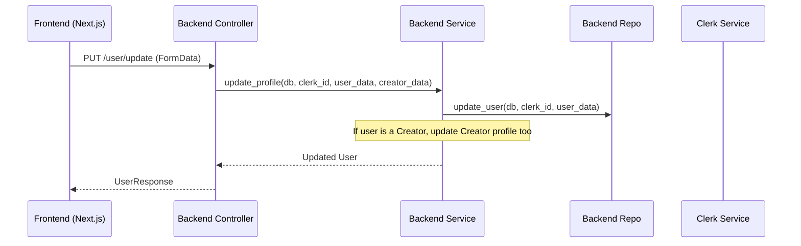

# Developer Manual: User Module

The User module is responsible for managing core user identity (linked to Clerk), profile details (name, bio, address), and public-facing profile views.

## 1. Program Structure

The User module is split into comprehensive backend and frontend components.

### Backend Structure (`okard-backend/src/modules/user`)
- [controller.py](file:///Users/wisapat/Documents/Code/Git/okard-backend/src/modules/user/controller.py): API endpoints for profile CRUD and existence checks.
- [service.py](file:///Users/wisapat/Documents/Code/Git/okard-backend/src/modules/user/service.py): Business logic, including coordination with the `Creator` module.
- [repo.py](file:///Users/wisapat/Documents/Code/Git/okard-backend/src/modules/user/repo.py): Database access logic for the `User` table.
- [model.py](file:///Users/wisapat/Documents/Code/Git/okard-backend/src/modules/user/model.py): SQLAlchemy model defining user attributes and relationships.
- [schema.py](file:///Users/wisapat/Documents/Code/Git/okard-backend/src/modules/user/schema.py): Pydantic schemas for validation and public/private profile responses.

### Frontend Structure (`okard-frontend/src/modules/user`)
- [api/api.ts](file:///Users/wisapat/Documents/Code/Git/okard-frontend/src/modules/user/api/api.ts): API client functions (`createUser`, `updateUser`, `listUsers`, etc.).
- [ExploreUserPage.tsx](file:///Users/wisapat/Documents/Code/Git/okard-frontend/src/modules/user/ExploreUserPage.tsx): Main page for discovery of users/creators with filtering.
- `components/`:
    - `UserEditPanel.tsx`: Form for updating profile settings.
    - `PublicProfilePanel.tsx`: View for public user profiles.
    - `UserForm.tsx`: Reusable form component for user data.

---

## 2. Top-Down Functional Overview

The User module acts as the "anchor" for other modules like Posts and Creators.

---

## 3. Subprogram Descriptions

### Backend: Controller Layer ([controller.py](file:///Users/wisapat/Documents/Code/Git/okard-backend/src/modules/user/controller.py))

| Subprogram | Responsibility | Input | Output |
| :--- | :--- | :--- | :--- |
| `create_user` | Syncs a new Clerk user with the local database. | `data` (JSON), `media` (File) | `UserResponse` |
| `update_user` | Updates user details and optionally creator profile details. | `data` (JSON), `media` (File) | `UserResponse` |
| `get_me` | Retrieves the currently logged-in user's data. | `payload` (JWT) | `UserResponse` |
| `user_exists` | Checks if a Clerk ID is already registered in our DB. | `clerk_id` (str) | `{exists: bool}` |

### Backend: Service Layer ([service.py](file:///Users/wisapat/Documents/Code/Git/okard-backend/src/modules/user/service.py))

| Subprogram | Responsibility | Input | Output |
| :--- | :--- | :--- | :--- |
| `update_profile` | Updates User record and conditionally updates Creator record. | `db`, `clerk_id`, `user_data`, `creator_data` | `User` object |
| `get_user_by_clerk_id` | Bridge to repository to fetch user by Clerk identifier. | `db`, `clerk_id` | `User` or `None` |

### Frontend: Components ([components/](file:///Users/wisapat/Documents/Code/Git/okard-frontend/src/modules/user/components))

| Subprogram | Responsibility | Input | Output |
| :--- | :--- | :--- | :--- |
| `ExploreUserPage` | Renders a searchable, filterable grid of users. | N/A (Client State) | User List UI |
| `UserEditPanel` | Handles the profile edit form and image uploading. | `initialUser` (User) | Profile Update Action |

---

## 4. Communication & Parameters

1.  **Clerk Integration**: The `clerk_id` is the primary key for identifying users across systems. It is passed as a path parameter or extracted from the JWT `sub` field.
2.  **FormData for Updates**: Profile updates use `multipart/form-data` to bundle the JSON user data and the optional profile image file.
3.  **JSON Payload**: The `data` parameter in `update_user` contains a nested structure: `{"user": {...}, "creator": {...}}`, allowing simultaneous updates to both profile layers.
4.  **Public vs. Private**: `schema.py` defines `UserPublicResponse` to exclude sensitive data (like address/tel) when showing profiles to other users.
